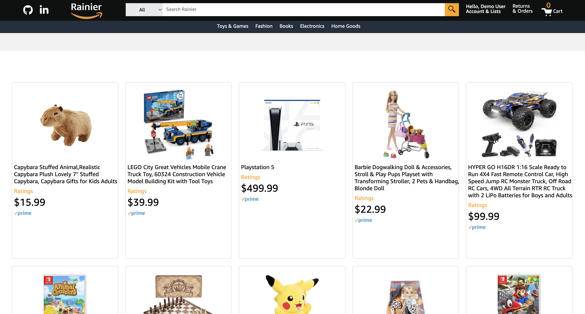
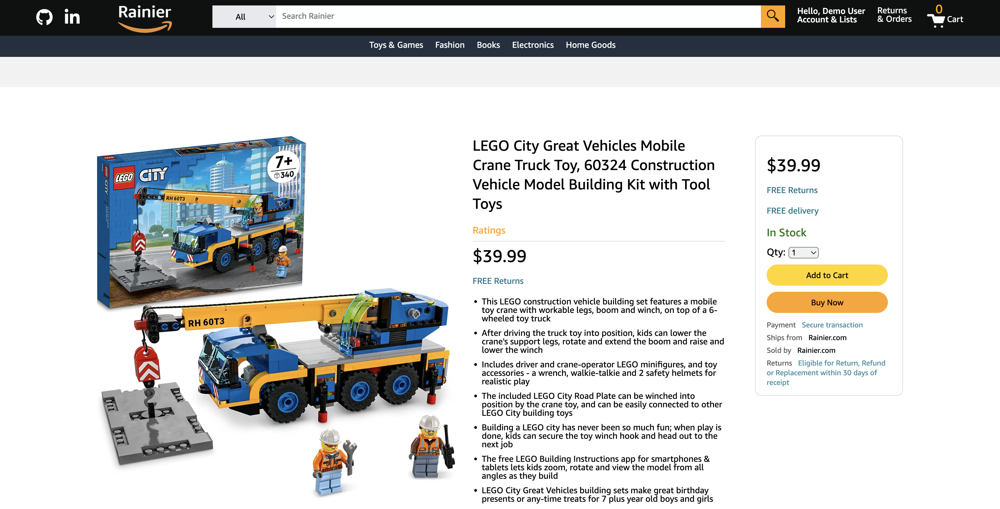
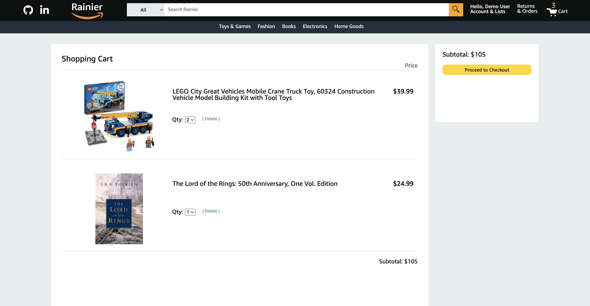

# Rainier

<a hreh="https://rainier.onrender.com/">Live Link</a>


## Introduction 

Rainier is a clone of the e-commerce website Amazon. Amazon is a website where users can browse and shop for anything they wish to purchase, as their product selection is plentiful across many product categories. On Amazon, users can create an account, search for the product they are interested, add products to their cart, and checkout those products. Products on Amazon are also filtered by their category. As a person who frequently uses Amazon, I thought it would be a great idea to try to create a clone of it. The technologies used in this project are:
* Languages: Javascript, Ruby, HTML, and CSS.
* Frontend: React-Redux
* Backend: Ruby on Rails
* Database: PostgreSQL
* Storage: Amazon AWS S3
* Site hosting: Render

# MVPs

# Product Listings

Rainier provides product listings to the user in order for the user to navigate the website and pick the product they are interested in. 



``` javascript
    return(
        <>
        <div id="fillerDiv"></div>
        <div id="productsIndexDiv">
            <ul id="productsIndexList" className='productsList'>
                {products.map((product) =>{
                    return (
                        <li key={product.id}>
                            <ProductIndexItem product={product}/>
                        </li>
                    )
                })}
            </ul>
        </div>
        </>
    )
```

The filtering for category occurs here, along with creating the individual product listing.

``` javascript
    const ProductIndexItem = (({product}) => {
    const { categoryName } = useParams();

    if(!product.category){
        return <NotFound />
    }
    
    if((product.category !== categoryName) && (categoryName !== "all")){
        return null;
    }
    
    return (
        <div id="productIndex" key={product.id}>
            <a id="productShowAnchor" href={`/products/${product.id}`}>
                <div id="indexImageDiv">
                    
                </div>
            </a>
            <a id="productShowAnchor" href={`/products/${product.id}`}>
                <h1 id="indexProductName">
                    {product.name}
                </h1>
            </a>
            <h1 id="indexProductReview">
                Ratings 
            </h1>
            <h1 id="indexProductPrice">
                ${product.price}
            </h1>
             
        </div>
    )
})
```

Users can click on a product listing and be directed to the show page for the product. Detailed information about the product is displayed on this page. On this page a user can select the quantity of the product they wish to purchase and add the product to their cart.



The logic for handling add to cart and selecting product quantity prior to adding to cart.

``` javascript
     const handleAddToCart = (e) => {
        e.preventDefault();
        
        if (!sessionUser){
            history.push(`/login`)
        } else {
            const user_id = sessionUser.id;
            const finalProduct = {product_quantity, user_id, product_id}
            dispatch(createCartItem(finalProduct))
        }
    }

    const updateSelector = (e) => {
        setQuantity(parseInt(e.currentTarget.value));
    }
```

# Shopping Cart 

When users add the desired product to their shopping cart, a cart item instance is created, linking the user and the product by their IDs. 



The shopping cart has full CRUD (Create, Read, Update, Destroy) functionality. Users can add an item to cart, read cart items, update the cart item's quantity, and delete a cart item from their cart. 

As with product listings, the displaying of cart items uses map to loop through the cart items and create an li element of a cart item index item component. The info for the cart item is passed through with props.

``` javascript 
    {cartItems.map((cartItem) =>{
        return (
            <li id="cartItem" key={cartItem.id}>
                <CartItemIndexItem cartItem={cartItem}/>
            </li>
        )
    })}
```

# Search 

Users can use the search bar to look for a product they are interested in. The search function matches product names to the keywords typed in by the user. 

``` javascript
    async function searchHandler(e) {
        e.preventDefault();
        const query = e.target.value;
        await setSearchText(query);
        dispatch(fetchSearchResults(query))
    }

    function searchSubmitHandler(e) {
        e.preventDefault();
        if(searchText.length > 0){
            history.push(`/search?keyword=${searchText}`);
        }
    }

    function searchSubmitHandlerEnter(e) {
        if(e.key === "Enter"){
            e.preventDefault();
            if(searchText.length > 0){
                history.push(`/search?keyword=${searchText}`);
            }
        }
    }
```

## Thank you

Rainier was built under a 2 week project time frame. Thank you for your interest.